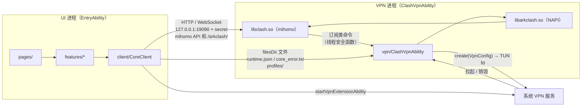
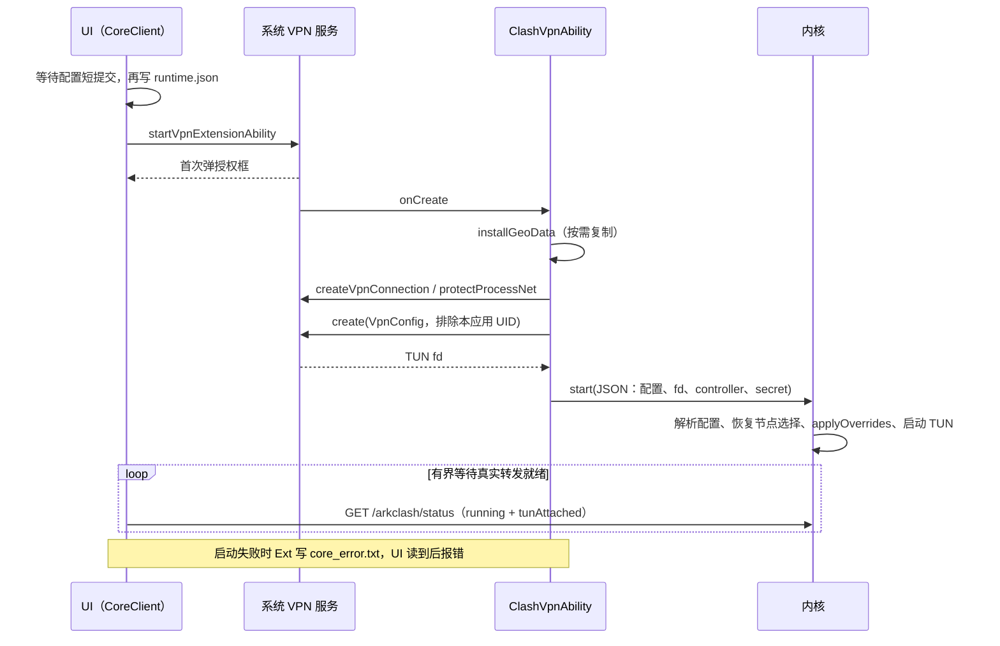

# 架构

产品目标和性能底线见 AGENTS.md「产品底线」，平台限制见 `docs/agents/platform-pitfalls.md`，关键决策的理由见 `docs/adr/`。

## 运行时结构


```mermaid
flowchart LR
  subgraph UI["UI 进程（EntryAbility）"]
    pages["pages/"] --> features["features/*"]
    features --> client["client/CoreClient"]
  end
  subgraph VPN["VPN 进程（ClashVpnAbility）"]
    ability["vpn/ClashVpnAbility"] --> bridge["libarkclash.so（NAPI）"]
    bridge --> core["libclash.so（mihomo）"]
    core -- "订阅类命令<br/>（线程安全函数）" --> ability
  end
  sys["系统 VPN 服务"]
  client -- "HTTP / WebSocket<br/>127.0.0.1:19090 + secret<br/>mihomo API 和 /arkclash/" --> core
  client -- "filesDir 文件<br/>runtime.json / core_error.txt<br/>profiles/" --> ability
  client -- "startVpnExtensionAbility" --> sys
  sys -- "拉起 / 销毁" --> ability
  ability -- "create(VpnConfig) → TUN fd" --> sys
```

- **UI 进程**只做界面和控制，不加载内核。界面恢复时重新查询运行事实，不能用上次的连接缓存断言 VPN 仍存活。
- **VPN 进程**持有 TUN fd 和内核，是代理的唯一运行位置。系统销毁扩展后不承诺继续转发，UI 被杀与真正内存回收的区别见 #58 的设备证据。
- 两个进程之间只有两条通道（[ADR-0003](adr/0003-ui-core-via-external-controller.md)）：
  - **内核控制面**：mihomo external-controller 承载运行查询、节点选择、测速、规则探测、流量与事件。ArkClash 路由在 `/arkclash/` 下：Go 处理运行快照、选择事务和热切换，订阅命令经 NAPI 转给 VPN 进程的 ArkTS（[ADR-0009](adr/0009-arkclash-commands-on-controller.md)）。独立进程专用的 `PUT`/`PATCH /configs`、`/restart`、`/upgrade` 保持关闭。
  - **文件通道**：`shared/Runtime.ets` 交接启动设置、错误和停止回执；`shared/profiles/Store.ets` 保存配置列表、内容、摘要及每配置节点选择。跨进程短提交持有存储锁，下载使用独立资源任务锁，不占住提交锁等待网络。
- UI 进程通过 `protectProcessNet()` 和应用排除名单保持直连；Go 出站由 `core/socket.go` 逐 socket 绑定物理网络（[ADR-0008](adr/0008-bind-core-sockets-to-physical-network.md)）。在线出口与服务检查走 `POST /arkclash/probe`，由内核按当前规则拨号，不要求订阅开放 HTTP 代理端口；停止时用 SDK 流式直连。两条路径共用 `client/ServiceRules.ets` 的 FlClash `be847366` 服务协议，不能统一用首页 HEAD 或仅凭 HTTP 状态判断服务可用性。
- 探测请求携带目标 URL、方法、正文模式、可选目标请求头/正文与重定向策略；controller 凭据不进入目标请求，跨源跳转移除目标 Authorization，并禁止 307/308 跨源重放非空正文。UI 与内核各约束四个实际执行名额，旧请求结束才释放；单步最多 10 秒、整批服务最多 60 秒，多步检查也必须保持同一 boot/revision。
- 探测响应包含目标状态、正文片段、最终 URL、Location、响应头延迟及 boot/revision。目标 403 等状态仍放在成功的 controller 信封内，不混同 controller 的 409/429/503/504。正文按用途限制：`none` 不收集正文，`small`/`html` 保留 16/512 KiB 前缀，`json` 必须是完整的至多 64 KiB，`scan` 最多扫描 8 MiB、返回首次命中起的当前窗口（32 KiB 加 256 字节重叠），保留同窗口内优先于地区的拒绝证据，不积存整页 HTML。
- 内核取得响应头后可立即停止无正文请求或命中的扫描。SDK 直连若没有提供状态行，则必须等 `requestInStream()` 完成才能可靠取得状态码：正文收集停止后丢弃后续块，应用累计接收超过 8 MiB 或超时即失败；该数值不是包含压缩、在途数据的网络流量上限。直连延迟保留头事件时间，没有状态行时无法严格区分中间响应头与最终响应头。

## 连接流程


```mermaid
sequenceDiagram
  participant UI as UI（CoreClient）
  participant Sys as 系统 VPN 服务
  participant Ext as ClashVpnAbility
  participant Core as 内核
  UI->>UI: 等待配置短提交，再写 runtime.json
  UI->>Sys: startVpnExtensionAbility
  Sys-->>UI: 首次弹授权框
  Sys->>Ext: onCreate
  Ext->>Ext: installGeoData（按需复制）
  Ext->>Sys: createVpnConnection / protectProcessNet
  Ext->>Sys: create(VpnConfig，排除本应用 UID)
  Sys-->>Ext: TUN fd
  Ext->>Core: start(JSON：配置、fd、controller、secret)
  Core->>Core: 解析配置、恢复节点选择、applyOverrides、启动 TUN
  loop 有界等待真实转发就绪
    UI->>Core: GET /arkclash/status（running + tunAttached）
  end
  Note over Ext,UI: 启动失败时 Ext 写 core_error.txt，UI 读到后报错
```

断开：UI 调 `stopVpnExtensionAbility`，扩展清理等待启动代次结束，再分别停止内核、销毁 VPN 连接；其中一项失败仍尝试另一项。扩展在创建资源前写入独立实例标识，两项都成功才写 `runtime-stopped.json`；UI 同时核对当前 secret 和实例，防止系统复用 secret 重新拉起时接受旧清理回执。系统直接杀死 VPN 进程或设备重启无法补写回执，此时由 `appManager.getRunningProcessInformation()` 成功返回且包含当前 UI PID、没有其他本应用进程，证明宿主已消失；查询前后 runtime/实例文件必须一致。查询异常、空列表、缺少 UI PID 或存在其他本应用进程均保留未知，不删除残留文件。controller 失联本身不算停止成功，清理失败保留停止确认入口（[ADR-0013](adr/0013-runtime-host-process-evidence.md)）。

启动从等待配置短提交起由 `CoreClient` 模块内 Promise 和宿主代次保护，覆盖 runtime 写好但系统尚未创建 VPN 进程的窗口；此时宿主查询一律未知。公开停止先取消该代次、请求停止，再等待启动收尾后重新取证；启动自身清理使用私有停止函数，避免等待自身。界面首次恢复未知只显示待确认状态，不生成启动意图；停止确认动作不依赖是否曾在本 UI 进程启动过。已发出的 HTTP 运行快照须再次核 secret/实例，取消后晚到的就绪结果不得成为连接成功。

节点选择携带 `expectedBootId` 和配置的 `expectedRevision`。`configRevision` 只在完整配置启动或热切换提交后前进；同一配置内连续选节点不会互相使请求过期。旧配置请求在 Go 事务内拒绝，持久化失败恢复原转发目标，幂等重放返回原操作结果。

## 状态归属

| 状态 | 归属 | 写入方 | 读取方 |
|---|---|---|---|
| 配置列表 `profiles/list.json`（订阅和配置的记录、当前配置） | 应用沙箱 | UI | UI、VPN 进程 |
| 配置内容、摘要、订阅状态（`profiles/` 下其余文件） | 应用沙箱 | 来自订阅的：未连接时 UI，连接中 VPN 进程；本地配置：UI | UI、VPN 进程、内核 |
| `runtime.json`（secret、协议栈、出站模式、局域网代理） | 应用沙箱 | UI，每次连接前和连接中改设置时 | VPN 进程 |
| `core_error.txt` | 应用沙箱 | VPN 进程 | UI，读后删除 |
| `runtime-instance.json`（当前扩展实例标识） | 应用沙箱 | VPN 进程，创建资源前 | UI、VPN 进程 |
| `runtime-stopped.json`（当前扩展实例清理完成回执） | 应用沙箱 | VPN 进程，内核与 VPN 连接均释放后 | UI，核对 secret 与实例 |
| `profiles/<id>.selected.json`（每配置节点选择） | 应用沙箱 | 离线 UI；在线 Go 选择事务 | UI、内核启动及热切换 |
| Geo 数据（`filesDir/*.metadb、*.dat`）和版本标记 `geo.version` | 应用沙箱 | VPN 进程，安装包里的版本变了才从 rawfile 复制 | 内核 |
| 用户设置（出站模式、局域网代理等） | UI 的 preferences | UI | UI |
| 运行时状态（节点选择、连接、流量、正在运行的配置） | 内核内存 | 内核 | UI，经 controller |

同一个应用的 UI 进程和扩展进程共享模块级的 `filesDir`。preferences 只在 UI 进程里用，扩展进程需要的信息都要落到文件通道里。两个进程都会写的文件一律先写临时文件再改名（`shared/Files.ets`），同一时刻只有一方在更新订阅，交接见 ADR-0009。

## ArkTS 分层与依赖方向

| 目录 | 职责 | 可以依赖 |
|---|---|---|
| `shared/` | 两个进程共用的代码：路径、文件读写，以及订阅更新（`shared/profiles/`，[ADR-0009](adr/0009-arkclash-commands-on-controller.md)） | 系统 Kit、`yaml` |
| `client/` | UI 访问内核的唯一入口：拉起/停止 VPN、controller 请求、数据模型 | `shared/` |
| `features/<功能>/` | 一个功能的状态、页面片段和组件（订阅、代理组、连接、日志、设置） | `client/`、`shared/`、`components/` |
| `components/` | 跨功能复用的界面组件，不带业务逻辑 | `shared/` |
| `pages/` | 路由入口，只负责把 feature 组装成页面 | 上面所有 UI 层 |
| `entryability/` | UI 进程入口 | `pages/` |
| `vpn/` | VPN 进程：TUN、内核生命周期、Geo 数据，连接期间的订阅更新和命令处理 | `shared/`、`libarkclash.so` |

规则：

- UI 层（除 `vpn/` 外的目录）不 import `vpn/`，也不 import `libarkclash.so`。
- `vpn/` 不 import 任何 UI 层目录。
- feature 之间不直接 import；被第二个 feature 用到的东西上提到 `components/`、`client/` 或 `shared/`。
- `components/` 第一次有实际内容时再建目录。
- 这些规则由 `scripts/check-arch.py` 检查（`make lint`）；新增目录时同时更新本表和脚本里的 `ALLOWED`。

## 内核层（Go）

| 文件 | 职责 |
|---|---|
| `core/lib.go` | 导出的 C API（`arkclash.h`）；`applyOverrides` 强制 ArkClash 接管的配置项；热切换 `reload` |
| `core/api.go` | controller 上的 `/arkclash/` 路由、转给 ArkTS 的命令、事件推送、经内核下载 |
| `core/runtime.go` | 原子运行快照、boot/revision 与事件 |
| `core/selection.go` | 幂等选择、原子保存、持久化失败补偿、转发前恢复 |
| `core/delay.go` | 8 执行槽测速、请求取消与配置代次隔离 |
| `core/probe.go` | 按当前规则执行出口/服务探测，共用内核证书信任 |
| `core/prefetch.go` | 在后台预先下载配置里的 rule-provider，第一次热切换不用等 |
| `core/tun.go` | 用系统给的 fd 启动 sing-tun（gVisor 栈），独立于配置的 TUN 设置 |
| `core/socket.go` | 通过 Network Kit 原生 API 保护 Go 出站 socket，绑定失败则拒绝拨号 |
| `core/hilog.go` | 内核日志转发到 hilog |
| `core/loopback.go` | 关闭回环检测（原因见 platform-pitfalls 第 4 条） |

TUN 由 `tun.go` 单独持有，不走配置文件，所以重新加载或切换配置都不会重建 TUN（[ADR-0001](adr/0001-core-in-vpn-extension.md)）。热切换只调 `executor.ApplyConfig`，不重建 controller（[ADR-0010](adr/0010-hot-switch-reload-in-vpn.md)）。

## 构建产物

```
core/ ── scripts/build-core.sh（补丁版 Go + OHOS NDK）──► entry/libs/arm64-v8a/libclash.so
Geo 数据 ── scripts/fetch-geodata.sh ──► entry/src/main/resources/rawfile/geo/
entry/ ── hvigor（CMake 编 NAPI 桥 + ArkTS）──► HAP
```

## 后续演进的约束

- **provider 预下载**：热切换要等新配置的 provider 全部加载完。`core/prefetch.go` 在后台预先下载 rule-provider，触发方是 VPN 进程（订阅更新后、连接 10 秒后）和界面（连接中导入本地配置后，经 `POST /arkclash/prefetch`）。proxy-provider 不预下载（原因见 ADR-0010）。
- **新的 ArkClash 命令**：挂在 `core/api.go` 的 `/arkclash/` 下。内核自己能完成的由 Go 处理；要用到 ArkTS 侧逻辑的，走 `/arkclash/profiles/{name}` 这类转发路由（ADR-0009）。
- **VpnConfig 级设置**（协议栈、IPv6、分应用代理、VpnConfig 里的 DNS 地址和 MTU）不能热切换，改了只能断开重连（ADR-0010）。
- **分应用代理**：`VpnConfig` 的 `trustedApplications` 和 `blockedApplications` 互斥。"只代理这些应用"用 trusted 列表，本应用不在列表里，自然被排除；"绕过这些应用"用 blocked 列表，列表里必须始终带上本应用（[ADR-0004](adr/0004-exclude-self-by-uid.md)）。
- **流量与连接**：用 controller 的 WebSocket（`/traffic`、`/connections`、`/logs`）推送，规则见 `docs/agents/ui.md`「性能」。
- **IPv6**：要同时给 `VpnConfig` 加 IPv6 地址和路由，给 `tun.go` 加 `Inet6Address`，两边一起改。
